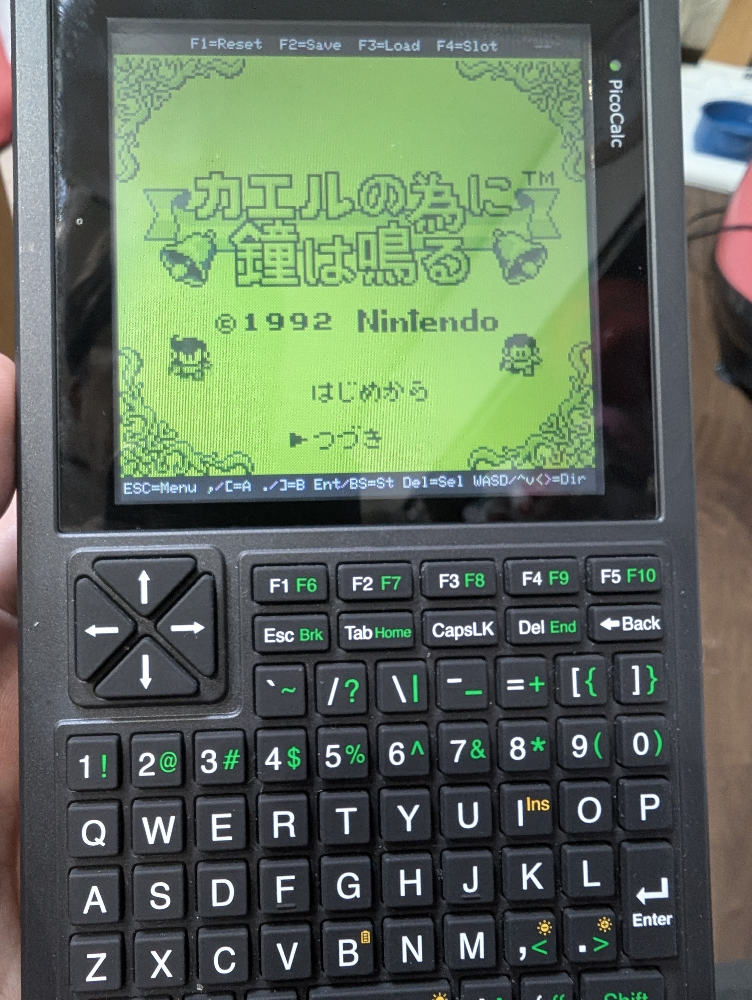
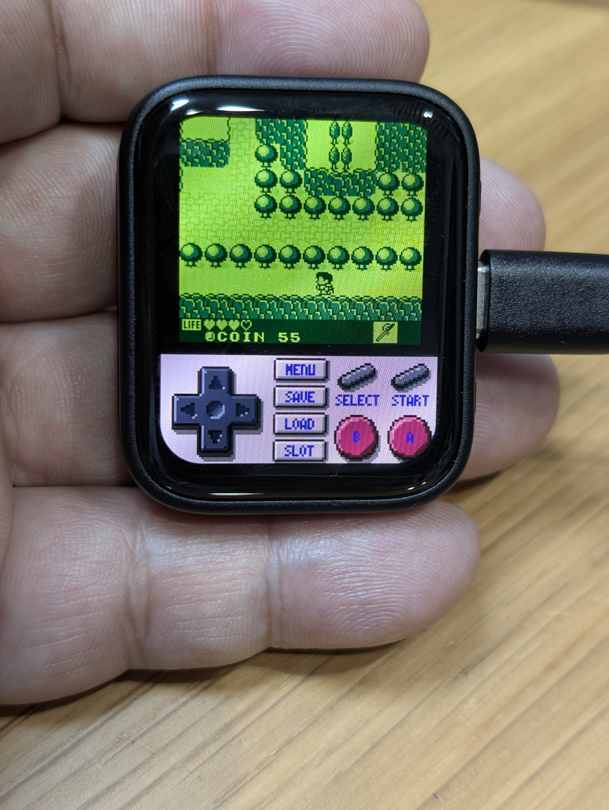

# RP2350-GB-Kaeru

Game Boy emulator for RP2350-based devices, built to play *For the Frog the Bell Tolls* (カエルの為に鐘は鳴る).

> **Note:** This emulator was built solely to play *For the Frog the Bell Tolls*. No other games have been tested, and there is no intention to test them.

---

## Supported Targets

| Target | Device | Build target |
|--------|--------|--------------|
| **PicoCalc** | ClockworkPi PicoCalc (RP2350A) | `picocalc_gb_kaeru` |
| **AMOLED** | Waveshare RP2350-Touch-AMOLED-1.8 | `amoled_gb_kaeru` |

---

## Features

### Common

- Game Boy (DMG) emulation via [Peanut-GB](https://github.com/deltabeard/Peanut-GB)
- ROM and save data stored in onboard Flash (SD card not required at runtime)
- Save states: 10 slots, stored in Flash
- Auto-save: SRAM written to Flash ~1 second after in-game save

### PicoCalc

- 160×144 → 320×288 2× scaled display (LovyanGFX, ~60 fps)
- 10 display palettes: DMG Green / Dark Green / Mono / Sepia / Amber / Cool Blue / Teal / Lavender / Rose / Red Mono
- PWM audio output (12-bit, ~32768 Hz, DMA IRQ driven)
- Keyboard input (STM32 I2C controller)
- In-game menu (ESC): palette, audio toggle, SD backup/restore, Clear Flash, Full Erase Flash

### AMOLED

- 160×144 → 320×288 2× scaled display on 368×448 AMOLED panel (~60 fps)
- 10 display palettes: DMG Green / Dark Green / Mono / Sepia / Amber / Cool Blue / Teal / Lavender / Rose / Red Mono
- I2S audio via ES8311 codec (32000 Hz, DMA IRQ driven)
- Touch input (FT3168, 1-point)
- Touch controls: D-Pad / face buttons / save state / slot / load state
- In-game menu (tap MENU button): palette, volume, SD backup/restore, Clear Flash, Full Erase Flash

---

## Screenshots

| PicoCalc | AMOLED |
|----------|--------|
|  |  |

---

## Hardware

### PicoCalc

| Item | Details |
|------|---------|
| Device | ClockworkPi PicoCalc |
| SoC | Raspberry Pi RP2350A |
| CPU | Dual-core Arm Cortex-M33 @ **150 MHz** |
| Display | ILI9488 SPI LCD, 320×320 |
| Audio | PWM direct to amplifier (GP26/27) |
| Input | STM32 I2C keyboard |

### AMOLED

| Item | Details |
|------|---------|
| Device | Waveshare RP2350-Touch-AMOLED-1.8 |
| SoC | Raspberry Pi RP2350 |
| CPU | Dual-core Arm Cortex-M33 @ **200 MHz** (overclocked) |
| Display | QSPI AMOLED, 368×448 |
| Audio | ES8311 I2S codec |
| Input | FT3168 capacitive touch |

---

## Flash Layout

Both targets share the same Flash layout:

```
0x000000 – 0x0FFFFF  ( 1 MB)  Firmware
0x100000 – 0x17FFFF  (512 KB) ROM image
0x180000 – 0x187FFF  ( 32 KB) SRAM save
0x188000 – 0x1D7FFF  (320 KB) Save states (10 slots × 32 KB)
0x1D8000 – 0x1DFFFF  ( 32 KB) Reserved
0x1E0000 – 0x1E0FFF  (  4 KB) Flash metadata
```

---

## Controls

### PicoCalc (keyboard)

| Key | Function |
|-----|---------|
| WASD / Arrow keys | D-Pad |
| `,` / `[` | A button |
| `.` / `]` | B button |
| Backspace / Enter | Start |
| Del | Select |
| F1 | Soft Reset |
| F2 | Save state (current slot) |
| F3 | Load state (current slot) |
| F4 | Change save slot (0–9) |
| ESC | Open/close menu |

### AMOLED (touch)

| Area | Function |
|------|---------|
| Left column of UI area | D-Pad (swipe direction from fixed center) |
| Right column — top-left | SELECT |
| Right column — top-right | START |
| Right column — bottom-left | B button |
| Right column — bottom-right | A button |
| Center column — row 1 | Open / close menu |
| Center column — row 2 | Save state |
| Center column — row 3 | Load state |
| Center column — row 4 | Cycle save slot (0–9) |
| POWER button (physical) | A button |

---

## Download & Flash

Pre-built UF2 binaries are attached to each [Release](../../releases).

1. Download the UF2 for your target:
   - `picocalc_gb_kaeru.uf2` — PicoCalc
   - `amoled_gb_kaeru.uf2` — AMOLED
2. Hold **BOOTSEL** and connect the device via USB.  
   It will appear as a USB mass storage drive named `RPI-RP2`.
3. Drag and drop the UF2 onto the drive, or copy it from the command line:

```sh
cp picocalc_gb_kaeru.uf2 /media/$USER/RPI-RP2/
```

The device reboots automatically once the file is written.

---

## Build

### Requirements

- [Raspberry Pi Pico SDK](https://github.com/raspberrypi/pico-sdk) (`PICO_SDK_PATH` must be set)
- CMake ≥ 3.13, Ninja, `gcc-arm-none-eabi`

See [DevelopmentEnvironment.md](DevelopmentEnvironment.md) for full setup instructions.

### Clone

```sh
git clone --recurse-submodules <repo-url> RP2350-GB-Kaeru
cd RP2350-GB-Kaeru
```

### Configure

```sh
cmake -S . -B build \
  -G Ninja \
  -DPICO_BOARD=pico2 \
  -DPICO_PLATFORM=rp2350 \
  -DCMAKE_EXPORT_COMPILE_COMMANDS=ON
```

### Compile

```sh
# PicoCalc
cmake --build build --target picocalc_gb_kaeru -j$(nproc)

# AMOLED
cmake --build build --target amoled_gb_kaeru -j$(nproc)

# Both
cmake --build build -j$(nproc)
```

### Flash

Hold **BOOTSEL** and connect via USB. The device appears as a USB mass storage drive (`RPI-RP2`). Drag and drop the UF2 onto the drive, or copy it:

```sh
# PicoCalc
cp build/picocalc_gb_kaeru.uf2 /media/$USER/RPI-RP2/

# AMOLED
cp build/amoled_gb_kaeru.uf2 /media/$USER/RPI-RP2/
```

### Flash Erase Options

| Operation | What is erased | Time | Access |
|-----------|---------------|------|--------|
| **Clear Flash** (in-app) | Metadata flags only (~50 ms); raw data stays but is unreachable | ~50 ms | Menu |
| **Full Erase Flash** (in-app) | ROM, SRAM save, all 10 save-state slots, metadata — physically erased; device reboots automatically | ~2.5 s | Menu |
| `picotool erase --all` | Entire Flash including firmware | ~3 s | USB (BOOTSEL) |

Use **Full Erase Flash** before a major firmware update or when giving the device to someone else.  
Hold BOOTSEL and connect via USB to run `picotool erase --all` only when you also want to erase the firmware.

---

## ROM Handling

ROM files are **not included** and are excluded from the repository (`.gitignore`).
Use only ROM images dumped from cartridges you legally own.

Place `kaeru.gb` in the `roms/` directory on the SD card and power on.
The firmware copies it to Flash; thereafter the SD card is not required.

Alternatively (AMOLED only), write the raw ROM binary directly to Flash:

```sh
picotool load kaeru.gb -t bin -o 0x10100000
```

---

## License & Acknowledgements

This project's original source code is licensed under the [MIT License](LICENSE).

This project would not exist without the following outstanding open-source libraries. Sincere thanks to their authors.

| Library | License | Role |
|---------|---------|------|
| [Peanut-GB](https://github.com/deltabeard/Peanut-GB) | MIT | Game Boy emulation core |
| [minigb_apu](https://github.com/deltabeard/Peanut-GB/tree/master/examples/sdl2/minigb_apu) | MIT | Game Boy APU (audio) |
| [LovyanGFX](https://github.com/lovyan03/LovyanGFX) | FreeBSD (2-clause BSD) | SPI LCD driver (PicoCalc) |
| [no-OS-FatFS-SD-SPI-RPi-Pico](https://github.com/carlk3/no-OS-FatFS-SD-SPI-RPi-Pico) | Apache 2.0 | SD card access |
| FatFs (embedded in above) | BSD-style (ChaN) | FAT filesystem |

Each library retains its own license. See the respective `LICENSE` files under `lib/`.

---

---

# RP2350-GB-Kaeru（日本語）

RP2350 系デバイス向け Game Boy エミュレータ。「カエルの為に鐘は鳴る」専用。

> **注意:** このエミュレータは「カエルの為に鐘は鳴る」をプレイするためだけに作りました。他のゲームの動作確認はしていません。

---

## 対応ターゲット

| ターゲット | デバイス | ビルドターゲット |
|-----------|---------|----------------|
| **PicoCalc** | ClockworkPi PicoCalc (RP2350A) | `picocalc_gb_kaeru` |
| **AMOLED** | Waveshare RP2350-Touch-AMOLED-1.8 | `amoled_gb_kaeru` |

---

## 機能

### 共通

- [Peanut-GB](https://github.com/deltabeard/Peanut-GB) による Game Boy（DMG）エミュレーション
- ROM・セーブデータをオンボード Flash に保存（実行時に SD カード不要）
- セーブステート: 10 スロット（Flash 保存）
- 自動セーブ: ゲーム内セーブの約1秒後に Flash へ自動書き込み

### PicoCalc

- 160×144 → 320×288 の 2倍スケール表示（LovyanGFX、約60fps）
- 10 種類のパレット: DMGグリーン / ダークグリーン / モノクロ / セピア / アンバー / クールブルー / ティール / ラベンダー / ローズ / レッドモノ
- PWM 音声出力（12bit、～32768Hz、DMA IRQ 駆動）
- キーボード入力（STM32 I2C コントローラ）
- ゲーム内メニュー（ESCキー）: パレット切替・音声ON/OFF・SD バックアップ・Clear Flash・Full Erase Flash

### AMOLED

- 160×144 → 320×288 の 2倍スケールを 368×448 AMOLED パネルに表示（約60fps）
- 10 種類のパレット: DMGグリーン / ダークグリーン / モノクロ / セピア / アンバー / クールブルー / ティール / ラベンダー / ローズ / レッドモノ
- I2S 音声（ES8311 コーデック / 32000Hz / DMA IRQ 駆動）
- タッチ入力（FT3168、1点タッチ）
- タッチ操作: 十字キー / ゲームボタン / セーブ / スロット / ロード
- ゲーム内メニュー（MENU タッチ）: パレット・音量・SD バックアップ/復元・Clear Flash・Full Erase Flash

---

## 動作イメージ

| PicoCalc | AMOLED |
|----------|--------|
|  |  |

---

## ハードウェア

### PicoCalc

| 項目 | 内容 |
|------|------|
| 本体 | ClockworkPi PicoCalc |
| SoC | Raspberry Pi RP2350A |
| CPU | Dual-core Arm Cortex-M33 @ **150 MHz** |
| ディスプレイ | ILI9488 SPI LCD、320×320 |
| 音声 | PWM アンプ直結（GP26/27） |
| 入力 | STM32 I2C キーボード |

### AMOLED

| 項目 | 内容 |
|------|------|
| 本体 | Waveshare RP2350-Touch-AMOLED-1.8 |
| SoC | Raspberry Pi RP2350 |
| CPU | Dual-core Arm Cortex-M33 @ **200 MHz**（オーバークロック） |
| ディスプレイ | QSPI AMOLED、368×448 |
| 音声 | ES8311 I2S コーデック |
| 入力 | FT3168 静電容量式タッチ（1点） |

---

## Flash レイアウト（共通）

```
0x000000   1 MB    ファームウェア
0x100000  512 KB   ROM データ（XIP 直読み）
0x180000   32 KB   SRAM セーブ
0x188000  320 KB   セーブステート × 10 スロット（各 32 KB）
0x1D8000   32 KB   予約済み
0x1E0000    4 KB   Flash メタデータ
```

---

## 操作方法

### PicoCalc（キーボード）

| キー | 機能 |
|------|------|
| WASD / カーソルキー | 十字キー |
| `,` / `[` | A ボタン |
| `.` / `]` | B ボタン |
| Backspace / Enter | スタート |
| Del | セレクト |
| F1 | ソフトリセット |
| F2 | ステートセーブ（現在スロット） |
| F3 | ステートロード（現在スロット） |
| F4 | セーブスロット切替（0〜9） |
| ESC | メニュー開閉 |

### AMOLED（タッチ）

| エリア | 機能 |
|--------|------|
| UI エリア左列 | 十字キー（固定中心からの方向） |
| 右列・左上 | SELECT |
| 右列・右上 | START |
| 右列・左下 | B ボタン |
| 右列・右下 | A ボタン |
| 中央列・行 1 | メニュー 開閉 |
| 中央列・行 2 | ステートセーブ |
| 中央列・行 3 | ステートロード |
| 中央列・行 4 | スロット切替（0〜9） |
| POWER ボタン（物理） | A ボタン |

---

## ダウンロード & 書き込み

ビルド済み UF2 は各 [Release](../../releases) に添付されています。

1. ターゲットに合った UF2 をダウンロード：
   - `picocalc_gb_kaeru.uf2` — PicoCalc
   - `amoled_gb_kaeru.uf2` — AMOLED
2. **BOOTSEL** ボタンを押しながら USB 接続する。  
   `RPI-RP2` という名前の USB マスストレージとして認識されます。
3. UF2 ファイルをそのドライブにコピーする（ドラッグ＆ドロップでも可）：

```sh
cp picocalc_gb_kaeru.uf2 /media/$USER/RPI-RP2/
```

書き込みが完了すると自動的に再起動します。

---

## ビルド方法

詳細は [DevelopmentEnvironment.md](DevelopmentEnvironment.md) を参照。

```sh
# クローン
git clone --recurse-submodules <repo-url> RP2350-GB-Kaeru
cd RP2350-GB-Kaeru

# CMake 設定
cmake -S . -B build -G Ninja \
  -DPICO_BOARD=pico2 -DPICO_PLATFORM=rp2350 \
  -DCMAKE_EXPORT_COMPILE_COMMANDS=ON

# ビルド（例: AMOLED ターゲット）
cmake --build build --target amoled_gb_kaeru -j$(nproc)

# 書き込み（BOOTSEL を押しながら USB 接続後）
cp build/amoled_gb_kaeru.uf2 /media/$USER/RPI-RP2/
```

---

## ROM の取り扱い

ROM ファイルはリポジトリに含まれておらず `.gitignore` で除外されています。
**合法的に所有・吸い出したカートリッジの ROM のみ**を使用してください。

SD カードの `roms/kaeru.gb` を置いて起動すると Flash に自動コピーされます。
以降は SD カードなしで動作します。

AMOLED では以下のコマンドで直接書き込むことも可能です:

```sh
picotool load kaeru.gb -t bin -o 0x10100000
```

---

## ライセンスと謝辞

本プロジェクトのオリジナルコードは [MIT ライセンス](LICENSE) で公開しています。

このプロジェクトは、素晴らしいオープンソースライブラリの上に成り立っています。  
作者の皆さんの仕事がなければ、カエルの鐘がここで鳴ることはありませんでした。

**[Peanut-GB](https://github.com/deltabeard/Peanut-GB)** — deltabeard 氏による軽量 Game Boy エミュレーションコア。移植性の高さと小さなフットプリントのおかげで、RP2350 上でのエミュレーションが現実のものになりました。このコアなくして、このプロジェクトは始まりませんでした。

**[minigb_apu](https://github.com/deltabeard/Peanut-GB/tree/master/examples/sdl2/minigb_apu)** — 同じく deltabeard 氏による Game Boy APU 実装。あのピコピコサウンドを正確に再現するための核心部分です。コイン音が正しく鳴ったとき、思わず声が出ました。

**[LovyanGFX](https://github.com/lovyan03/LovyanGFX)** — lovyan03 氏による高機能グラフィックスライブラリ。複雑な SPI LCD の初期化から差分描画まで、痒いところに手が届く設計に何度も助けられました。PicoCalc の画面にゲーム画面が映し出されたあの瞬間は忘れられません。

**[no-OS-FatFS-SD-SPI-RPi-Pico](https://github.com/carlk3/no-OS-FatFS-SD-SPI-RPi-Pico)** / **FatFs (ChaN 氏)** — RP2350 上での SD カードアクセスを支えてくれる組み合わせ。ROM の受け渡しから SD バックアップまで、縁の下で確実に動き続けています。

| ライブラリ | ライセンス |
|-----------|-----------|
| [Peanut-GB](https://github.com/deltabeard/Peanut-GB) | MIT |
| [minigb_apu](https://github.com/deltabeard/Peanut-GB/tree/master/examples/sdl2/minigb_apu) | MIT |
| [LovyanGFX](https://github.com/lovyan03/LovyanGFX) | FreeBSD (2-clause BSD) |
| [no-OS-FatFS-SD-SPI-RPi-Pico](https://github.com/carlk3/no-OS-FatFS-SD-SPI-RPi-Pico) | Apache 2.0 |
| FatFs（上記に内包） | BSD-style (ChaN) |

各ライセンス全文は `lib/` 以下を参照してください。
